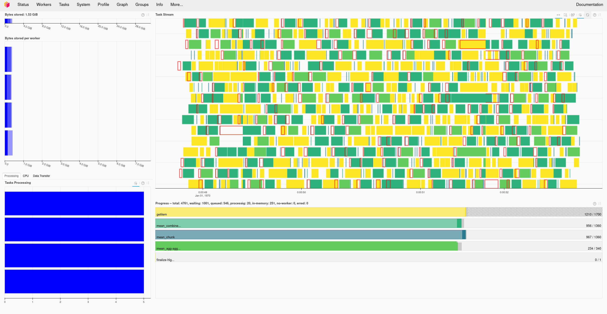

---
jupytext:
  formats: md:myst
  text_representation:
    extension: .md
    format_name: myst
    format_version: 0.13
    jupytext_version: 1.11.5
kernelspec:
  display_name: Python 3
  language: python
  name: python3
---

# Using dask with Datasets

## Fundamentals of Dask

In this notebook we are going to use the example of rebinning VISP data to discuss how the Dask array backing the `Dataset` object works.
Dask is a Python package for out-of-memory and parallel computation in Python, it provides an array-like object where data is only loaded and processed on demand.
`Dataset` uses Dask to track the data arrays, which it stores in the `Dataset.data` attribute.

To demonstrate this let's load the VISP sample dataset.

```{code-cell} python
import matplotlib.pyplot as plt

import dkist
from dkist.data.sample import VISP_BKPLX

ds = dkist.load_dataset(VISP_BKPLX)
```

This Dask object behaves in many ways just like a numpy array.
For instance, it can be indexed and sliced in the same way.

```{code-cell} python
ds.data[0, :, :, :200]
```

And it has many of the same methods for calculating useful properties of the data, such as `min()`, `max()`, `sum()`, etc.
These are in fact just wrappers around the numpy functions themselves, so they behave in the same way.
For example, to find the sum over the spatial dimensions of our data to make a spectrum, we could do:

```{code-cell} python
ds[0].data.sum(axis=(0,2)) # ds[0] because we only need Stokes I
```

What you will notice when you call these functions that they don't return a number as you would expect.
Instead they give us a Dask array which represents the result of that calculation.
This is because Dask delays the actual calculation of the value until you explicitly tell it to do it using the `compute()` method.
So to see the actual output of the above command we would do this:

```{code-cell} python
ds[0].data.sum(axis=(0,2)).compute()
```

A benefit of this is that since the operation returns us another Dask array, we can do more calculations with that, and those are also delayed.
This means that you can string together any number of calculations and only perform the costly step of getting the actual answer once.
So if we want to find the location of the lowest value in this spectrum, we can do

```{code-cell} python
spectrum = ds[0].data.sum(axis=(0, 2))
wl_idx = spectrum.argmin()
wl_idx
```

However, `Dataset` will automatically run the compute method in cases where it can be reasonably impled the user wants it, or if another package requires a plain numpy array.
For instance, `pixel_to_world`'s underlying computation is not dask aware so it forces the array computation instead of delaying it.
```{code-cell} python
wl = ds[0].wcs.pixel_to_world(0, wl_idx, 0)[1]
wl
```

Similarly, plotting a Dask array will prompt it to compute - otherwise the plot would be empty.

```{code-cell} python
spectrum = ds[0].data.sum(axis=(0,2))
plt.plot(spectrum)
```

When performing these operations, Dask breaks up the array into chunks, and operations will generally be faster and use less memory when they require fewer chunks.
In the case of a `Dataset`,  each chunk consists of the array stored in one FITS file.

## Rebinning with `NDCube`

We are going to use the {obj}`ndcube.NDCube.rebin` method:

```{code-cell} python
---
tags: [output_scroll]
---
help(ds.rebin)
```

This rebin method can reduce the resolution of a dataset, *by integer numbers of pixels*.
We'll therefore first crop the dataset so that it's divisible by the number of pixels we want to rebin.

```{code-cell} python
ds = ds[..., :2540]
```

So now if we wanted to combine groups of 4 pixels together along the slit dimension we can do this:
```{code-cell} python
ds_rebinned = ds.rebin((1, 1, 1, 4))
ds_rebinned
```

```{note}
Because we are using Dask, this hasn't actually done any computation yet, but is has reduced the size of the dask array.
```

Let's compare two spectra, one from the rebinned dataset and one from the original:

```{code-cell} python
plt.figure()
ax = ds[0, 100, :, 500].plot()
ds_rebinned[0, 100, :, 125].plot(axes=ax, linestyle="--")
```

As one final example of rebin, let's rebin in both the rastering dimension and the slit.
Let's rebin to bins of 5x10 pixels.

```{code-cell} python
ds_rebin2 = ds.rebin((1, 5, 1, 10))
```

```{code-cell} python
plt.figure()
ax = ds[0, 100, :, 500].plot()
ds_rebinned[0, 100, :, 125].plot(axes=ax, linestyle="--")
ds_rebin2[0, 20, :, 50].plot(axes=ax, linestyle=":")
```

## Computing in Parallel

By default dask will parallelise operations as much as is possible, over the available cores in your machine.
The Dask project also supports parallelising over the distributed compute such as HPC or cloud computing.
For this next section we are going to use this `distributed` package as a way of visualising the parallelisation.

```{note}
The following section requires the `distributed` and `bokeh` Python packages.
These can be installed using either conda or pip (e.g. `conda install distributed bokeh`).
```

First we'll set up the dask distributed client which will coordinate the computation.

```{code-cell} python
from dask.distributed import Client
client = Client()
client
```

This gives us a dashboard which can be viewed in the browser and will show us the progress of the computation.

Then we can set up a rebinning operation on our dataset object.

```{code-cell} python
ds_rebin3 = ds.rebin((1, 5, 1, 10))
```

Now when we run the actual compute, the client will distribute it over the available resources and the dashboard will show us the progress of all the required tasks.
The result will look something like this:


